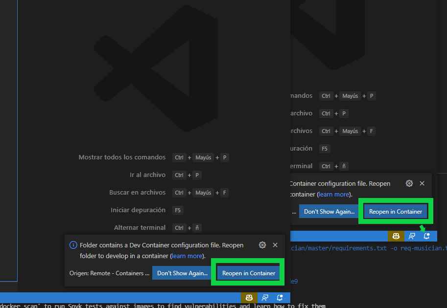

# Desarollo remoto de Pangea

Esta rama, continene todos los archivos necesarios para realizar un desarollo en remoto de el proyecto de Pangea

## Requisitos

De momento, hace falta tener instalado VSCode, mas tarde creare un entorno de desarollo independiente de este IDE

- [VSCode](https://code.visualstudio.com/)
- Extensión: [VSCode Remote Tools](https://marketplace.visualstudio.com/items?itemName=ms-vscode-remote.vscode-remote-extensionpack) (Te aparecera un cuadro abajo a la derecha si abres VSCode en esta carpeta)

## Ventajas de usar este entorno de desarollo con VSCode

- Entorno totalmente preparado e integrado con python
- Linter conectado con VSCode, estandar utilizado PEP8
- VSCode, con varias extensiones auto-instaladas para el entorno de DJango

## Pasos para iniciar el desarollo

1. Descargar esta rama de desarollo
2. Segun lo que quiera el usuario, hay varias opciones
   - Run_Env.sh workspace --> Se añade las carpetas al entorno de desarrollo
   - Run_Env.sh remote    --> Se crean ventanas especificas para el entorno de desarollo (Mayor prioridad)
   - Run_Env.sh none      --> Simplente construye el entorno sin interaccionar con VSCode

carpeta src hace de portal a los contenedores correspondientes

Dejo aqui una imagen con los pasos muy encillos de como abrir los contenedores en el modo remote
